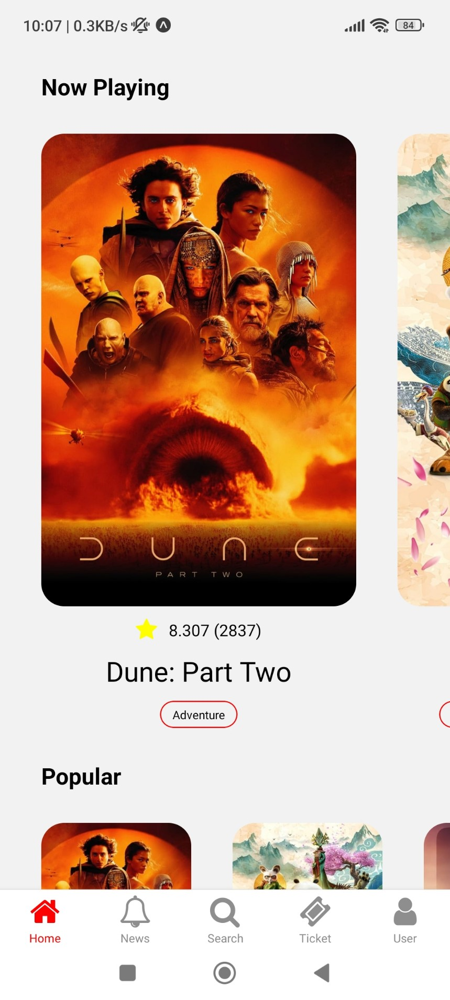

# Ticket Movie &middot;  [](https://www.npmjs.com/package/npm) [](https://github.com/vn-vietnam)


<!--  -->
<p float="left">


</p>
<p float="left">



</p>

## Table of Contents

- [Introduction](#Introduction)
- [Features](#Features)
- [Technologies](#Technologies)
- [Installing](#Installing)
- [Demo](#Demo)
- [Prerequisites](#Prerequisites)
- [Setting up Dev](#Setting-up-Dev)

## Introduction

- Mobile app book movie online

## Features

- Book Movies Conveniently and Quickly:
  - Dark and Light Mode
  - Using database Movies from [TMDB](https://www.themoviedb.org) and fetch data 
  - Choose movie and ticket
  - Select day, time of movie
  - Print QR code for ticket
  - Search movie
  - Login with Google

## Technologies

React Native - TypeScript - Expo - Clerk

## Installing

A quick introduction of the minimal setup you need to get a hello world up &
running.

- Create file .env.example to file .env
- Register account [Clerk](https://clerk.com) add EXPO_PUBLIC_CLERK_PUBLISHABLE_KEY to file .env

```shell
npm install
npm start
```

## Demo

You can try it [here](https://expo.dev/preview/update?message=update&updateRuntimeVersion=1.0.0&createdAt=2024-04-16T04%3A19%3A18.321Z&slug=exp&projectId=d2961c41-5aab-4f9c-bbb3-e3e1eb597e25&group=32f5aadc-b9fb-44ee-bc33-1df1499f4bae)

## Prerequisites

Please check file .env.sample

## Setting up Dev

Here's a brief intro about what a developer must do in order to start developing
the project further:

```shell
git clone https://github.com/vn-vietnam/movie-booking.git
cd movie-booking/
npm install
```
